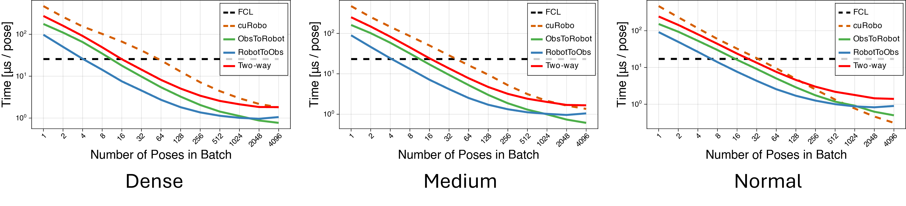
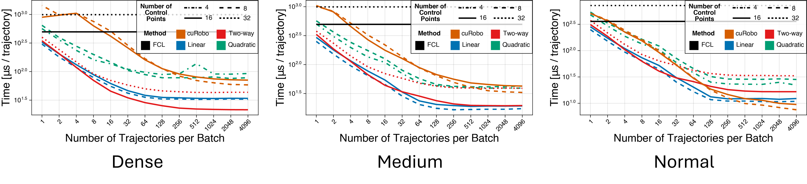

Calibrate a dual-robot system by modeling and solving the problem with Geometric Algebra and Geometric Calculus. The proposed method is <b>~4x</b> faster than the state-of-the-art algorithm while maintain <b>the same level of accuracy</b>.

## Algorithms

Demonstration of our collision detection methods: discrete-pose collision detection by ray-tracing (a) along obstacle meshes  and (b) along robot meshes, and continuous collision detection by ray-tracing against swept sphere-approximated robot volumes (c) along piecewise-linear paths or (d) along quadratic B-spline paths.

## Method

## Result

For robot link meshes totaling 24k triangles and obstacle meshes of over 190k triangles, our methods were up to 3 times faster in batched discrete-pose queries than a state-of-the-art GPU-based method using a sphere robot representation. For the same obstacle mesh scene, our sphere-robot continuous collision detection was up to 9 times faster depending on trajectory batch size.

[Download paper here](https://arxiv.org/abs/2409.09918)